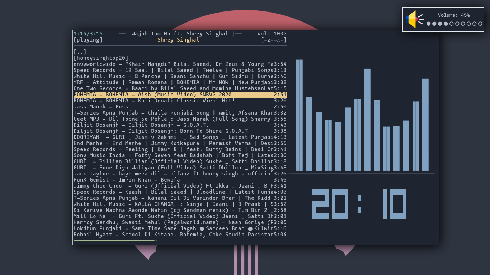
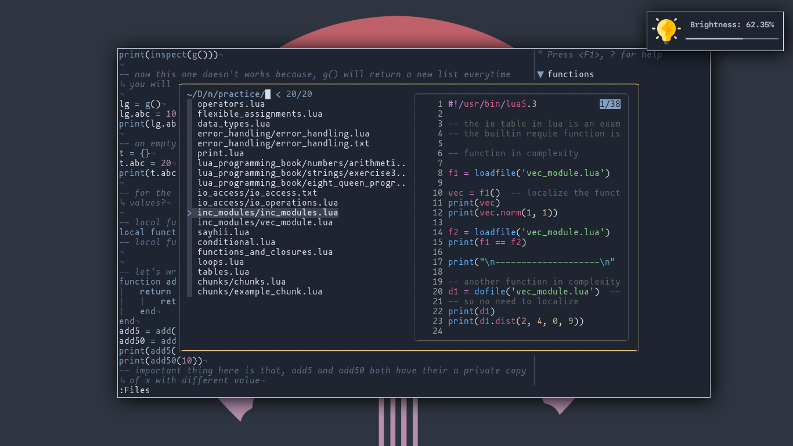
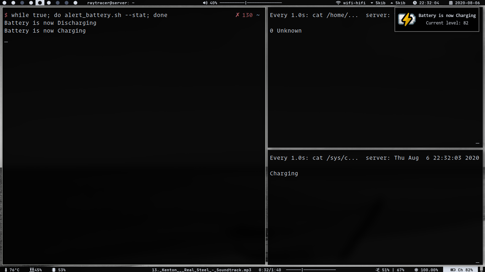
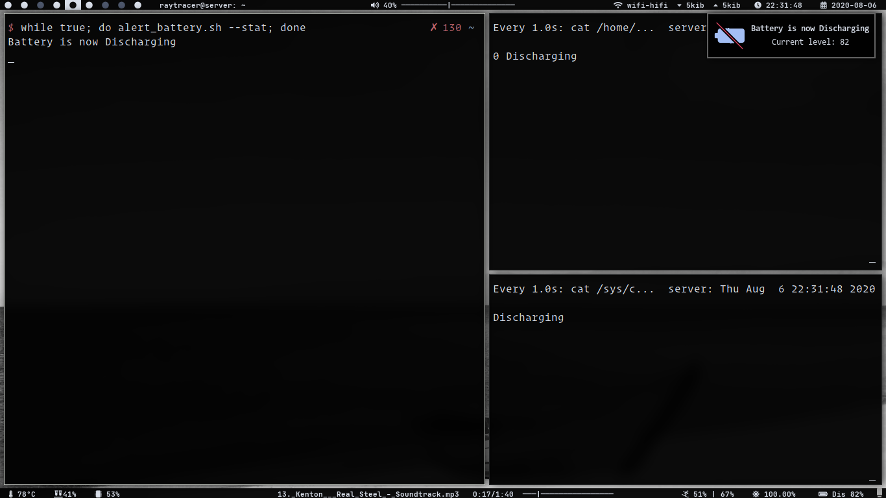
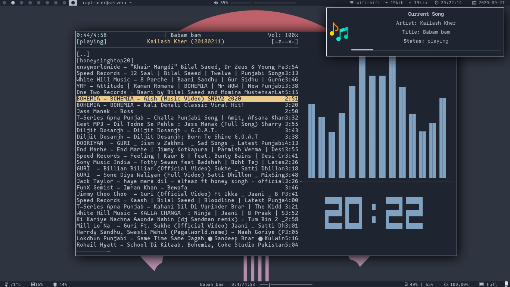

# notifyChanges

Get the notifications for happening of different changes in your WM.

## Features:

Currently included:
* Notification for volume
* Notification for brightness
* Notification for battery status
	+ when battery is charged full
	+ when battery is charging
	+ when battery is discharging
	+ when battery is below critical level
* Notification for song changes(uses `mpc` as client and `mpd` as daemon)

## Screenshots

See the changes for yourself:

* **Volume:**

<!--  -->

* **Brightness:**

<!---->

* **Battery:**

<!---->

<!---->

* **Song:**

<!---->

